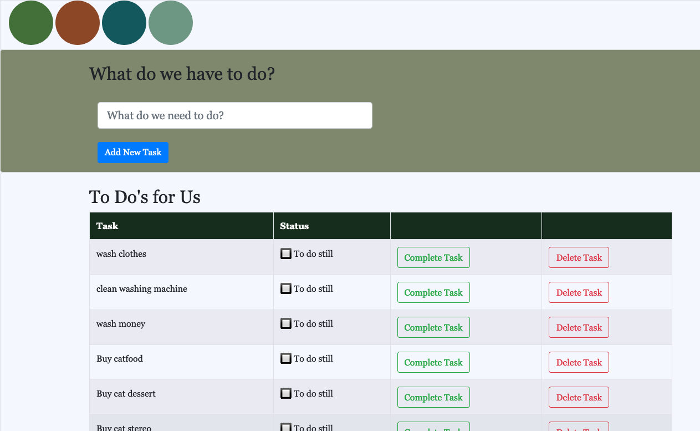

# Weekend-To-Do-App

## Description

_Duration: 3 day Sprint_

The project was to create a To Do application which would take in a task from the user, store it inside of a database (SQL). The user should also be able to track the time it was submitted, then be able to update completion status and remove the task when desired (deleting it from the database). This task required learning different methods of speaking to a server and database.

It also required CSS styling to update the background color of the page, add a font family, size, and update the color of tasks when completed to visually show the user when items were completed.

To see the fully functional site, please visit: [DEPLOYED VERSION OF APP](www.heroku.com)

## Screen Shot

### Prerequisites

- [Node.js](https://nodejs.org/en/)
- [jQuery] (https://jquery.com/)
- [Bootstrap] (https://getbootstrap.com/)
- [SweetAlert] (https://sweetalert.js.org/guides/)
- [pg-pool] (https://www.npmjs.com/package/pg-pool)

## Installation

Created through installing jQuery, Bootstrap, pg-pool, and Sweetalert, all accessible through `npm install`. The project requires Postico/Postgress in order to maintain a database to write and read.

1. Create a database named `weekend-to-do-app`,
2. The queries in the `database.sql` file are set up to create all the necessary tables and populate the needed data to allow the application to run correctly. The project is built on [Postgres](https://www.postgresql.org/download/), so you will need to make sure to have that installed. We recommend using Postico to run those queries as that was used to create the queries. NOTE: This step is optional and only uses the data to display a full to-do list for visibility. 
3. Open up your editor of choice and run an `npm install`
4. Run `npm install pg` in your terminal
5. Run `npm install express` in your terminal
6. Run `npm install bootstrap` in your terminal
7. Run `npm install sweetalert2` in your terminal
5. Run `npm start` in your terminal to start the server

## Usage
How does someone use this application? Tell a user story here.

1. Submit a task (eg. Wash Car)
2. The task is added to a list, going from first added to most recent added
3. As the user completes their tasks as they go
4. The ability to cross off completed goals gives the user a sense of accomplishment
5. Deleting old to-do tasks allows the user to quickly clean up to-do lists!

## Built With

HTML, Javascript, Node.js, jQuery, SweetAlert, Bootstrap, Postico, Postgres, Mozilla Firefox

## License
[MIT](https://choosealicense.com/licenses/mit/)

_Note, include this only if you have a license file. GitHub will generate one for you if you want!_

## Acknowledgement
Thanks to [Prime Digital Academy](www.primeacademy.io) who equipped and helped me to make this application a reality. 

## Support
If you have suggestions or issues, please email me at [grav0165@gmail.com](grav0165@gmail.com)